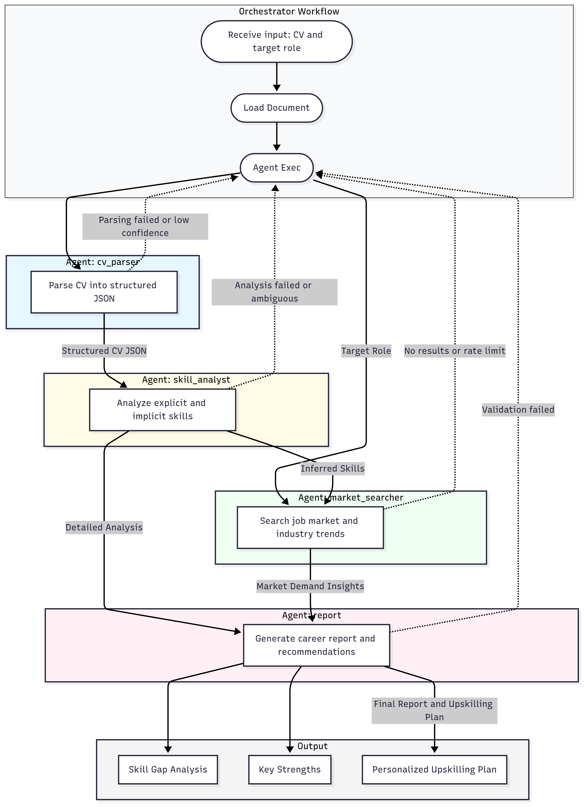

# Orchestrator Workflow for Career Analysis

This repository contains an **Orchestrator Workflow** designed to analyze a **CV (Curriculum Vitae)** and a target role, then generate a career report that includes **skill gap analysis**, **key strengths**, and a **personalized upskilling plan**.

## 📌 Workflow Overview

1. **Input**  
   The system receives input: **CV** and **target role**.

2. **Document Loading**  
   The CV document is loaded into the system.

3. **Agent Execution**
   - **Agent: cv_parser**  
     Parses the CV into **structured JSON**.  
     - If parsing fails or confidence is low → process stops.
   - **Agent: skill_analyst**  
     Analyzes both explicit and implicit skills from the CV.  
     - If analysis fails or is ambiguous → process stops.
   - **Agent: market_searcher**  
     Searches job market trends and industry demands based on inferred skills and the target role.  
     - If no results or rate limit is reached → process stops.

4. **Agent: report**  
   Generates a career report and actionable recommendations based on the **detailed skill analysis** and **market demand insights**.

5. **Output**  
   The final report includes:
   - ✅ Skill Gap Analysis  
   - ✅ Key Strengths  
   - ✅ Personalized Upskilling Plan  

## 🖼️ Workflow Diagram

## 🚀 Final Deliverables
- **Comprehensive Career Report**  
- **Upskilling Plan** tailored to the target role and market demands.

---
✍️ Built to simplify **AI-powered career planning**.
